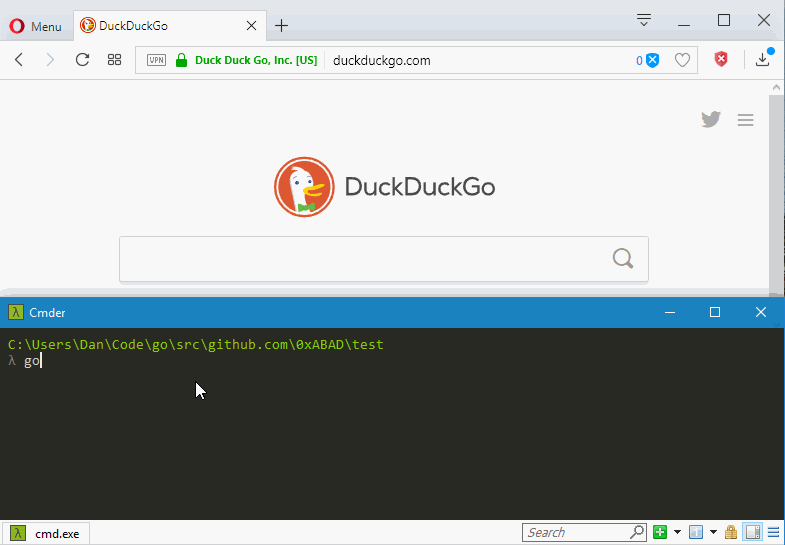

Gooey
=====

A framework to create single executable web apps.

Overview
--------

Gooey provides a base to create a single executable that displays a GUI through
the user's default browser.  It is designed to automatically open a browser tab
when double clicked, communicate through websockets, and automatically shutdown
when the user closes the last tab connected to the server.  Some use cases for
Gooey are simple tools that could benefit from a GUI or a debug dashboard for
a service, all without the heavy weight of something like Electron or having try
to use GUI bindings that are tied to a particular platform.

Quickstart
----------

First, if you haven't already, ```go get github.com/0xABAD/gooey```.  Then
create a new directory for a Go package and copy this code:

```
package main

import (
	"fmt"
	"os"
	"os/signal"
	"time"

	"github.com/0xABAD/gooey"
)

func main() {
	var (
		app    testApp
		server gooey.Server
		notify = make(chan os.Signal)
		done   = make(chan struct{})
	)
	signal.Notify(notify, os.Kill, os.Interrupt)
	go func() {
		<-notify
		close(done)
	}()
	server.Start(done, &app)
}

type testApp struct{}

func (a *testApp) Start(closed <-chan struct{}, incoming <-chan []byte, outgoing chan<- interface{}) {
	count := 0
	ticker := time.NewTicker(1 * time.Second)
	for {
		select {
		case <-closed:
			return
		case <-ticker.C:
			outgoing <- fmt.Sprintf("Message from server.  Count %d", count)
			count++
		}
	}
}
```

Now run `go run test.go`.  You should see something like this:



Some things you may have noticed:

* A browser window was automatically opened
* The address shows a random port number assigned
* We see the message being pushed from the server once a second
* The page loaded was embedded within the executable
* When closing the tab the server was automatically shutdown

Of course, all of this functionality may be configured through the
`gooey.Server struct`.  See the 
[documentation](https://godoc.org/github.com/0xABAD/gooey) for more.


Setup Tool
----------

Gooey comes with a setup tool that commands that may aid in development:

- **local** `go run setup.go local`: This command will convert gooey to be installed
as a local package.  This is for those don't want to put their project on their *gopath*
and want to pin down certain versions for their dependenices.  When run this command will
transform the imports of its sub packages that it uses to be relative local imports (i.e.
use "./filewatch" instead "github.com/0xABAD/gooey/filewatch").  This commands needs
to be run inside the gooey directory.

- **gopath** `go run setup.go gopath`: The inverse of the *local* command as it will
convert relative local imports to those that refer to the gopath.  This commands needs
to be run inside the gooey directory.

- **favicon** `go run setup.go favicon FILE PACKAGE_NAME`: This will create a
file named `favicon.go` that contains `const FAVICON string` where the value is
the contents of **FILE** encoded in base64.  The file will placed under the package
designated by **PACKAGE_NAME**.  The `favicon.go` will be created in the directory
of where this command is run.  You can assign the `FAVICON` string as a value to
the `FavIcon` field in the `gooey.Server` struct.

LICENSE
-------

Gooey is licensed under Zlib license but it does use
[gorilla/websocket](https://github.com/gorilla/websocket), while having a
permissive license, requires you redistibute its license whether redistibuting
in source or binary form.
